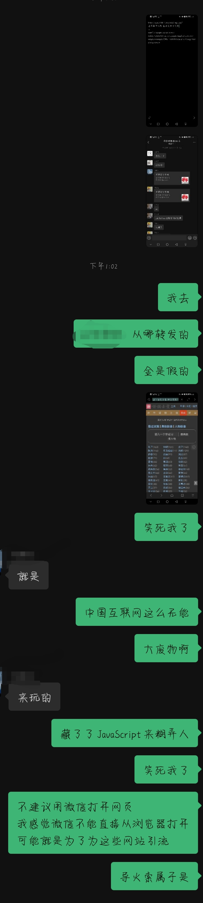
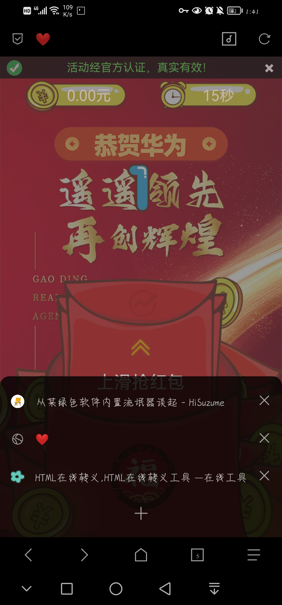

### 从某小而美软件的内置流氓器谈起

中国互联网谣言、骗局的导火索，潜伏着一条大型灰产产业链。

> Author：HiSuzume
> 
> Time：2023.9.17
> 
> Tip：严禁转载，引用请标注来源

关于导语，为什么要这么说呢？

来看看吧

本图讲述了一个庆祝华为突破的链接，用微信内置打开会有抢红包界面。因为任何网页都能访问微信用户的信息（弹出"正在登录中")，因此我没有进行其他操作。其他浏览器打开这个古诗词网站会卡加载，网页标题显示任意 Emoji

（这死人古诗词网站还能在Get参数往网页注入JavaScript，安全性一言难尽，还有这个[真实链接](https://mababa-1258518909.cos.ap-chengdu.myqcloud.com/index.html?t=0.5401964046107568)也是个死妈玩意，净会糊弄人)

我猜测，这玩意要转发才能领钱，可是怎么可能呢？

这个算是比较常见的脑残连，下面有一个更严重的：

我同学因为所谓的“小主播投票”网页制造的虚假微信登录被骗取账号密码。

而他却说手机被木马了

后来，网站404了，我再也无法了解更多的内幕了……

这些迹象，为什么会存在呢？

是腾讯审核网页不严？国家没有管好？

其实都不是，最重要的原因是：

**某小而美软件打开链接不是调用其他浏览器，而是微信自身**

而且某小而美软件为这个“浏览器”添加了“后门”，让任何软件都能从这个“后门”对真实用户进行操作。

而且更严重的问题是，因为某小而美软件很多页面都是由网页构成的，因此虚假的网页例如登录页面，让人防不胜防。

你们说，这下是谁的问题？

某小而美软件内置“浏览器”什么都干不了，还留“后门”，为什么都还在这样？

为什么就不能为链接卡片消息提供一个“外部浏览器打开”的选项呢？

被贿赂了？被收买了？内部腐败？

虽然说，这都不太可能，但是绝对不能排除。

毕竟，某些大厂都为了利益，对人民的使用体验毫不关心，甚至“强奸”用户。

很多人天天骂，可是有用吗？

一个大厂，掌握了人民的底层命脉，人民犹如韭菜一样，任由某大厂收割，连根拔起。

 

**如果说电信诈骗是华人的内耗，那么某些大厂通讯平台就是事件的巨型导火索，一个很深、很长的灰产产业链，他们互相关联着，而我们人民，就是最后的受害者……**

*中国互联网，走向末日了，吗？*

HiSuzume 2023.9.17
