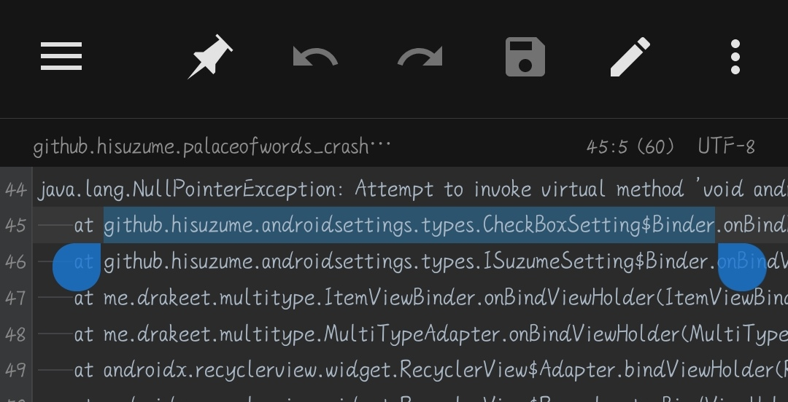
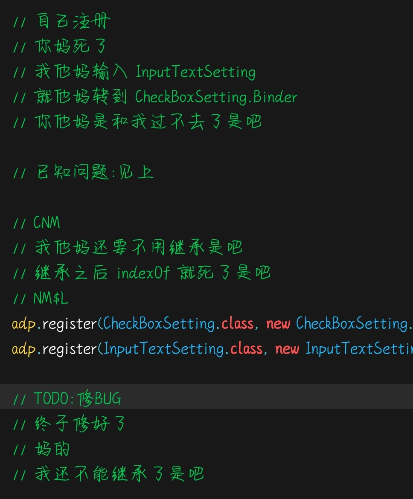

### 如题

当 List indexOf 出毛病的时候

我一开始使用 MultiType 的时候，我很自信地认为：和以前一样，写个基类，再继承就好了

当时先写了聊天列表，因为内容单一，没有出问题

可是直到我弄设置页面的时候，我才发现......

事情不对劲！

我弄了一个 CheckBox 和一个 InputText

可是添加 InputText 之后，空指针异常就找上门来

查证发现，不是 CheckBox 的问题，是类型对应错误

我查阅文档，一直无果

查阅源代码后才晃然一悟：是不是因为继承导致匹配了父类？

我删掉基类，重写

最后......

成功了？！

唉，这会我不能怪人家 MultiType 了，只能怪 Java 的特性了！

