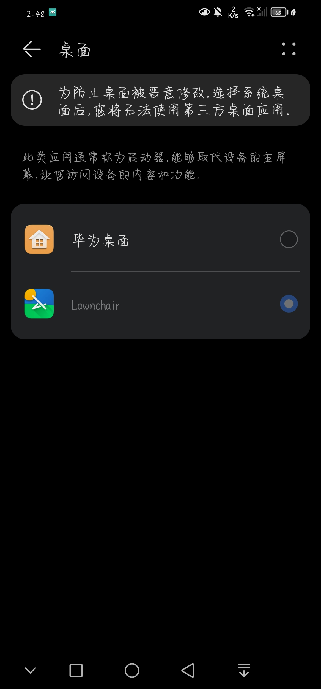
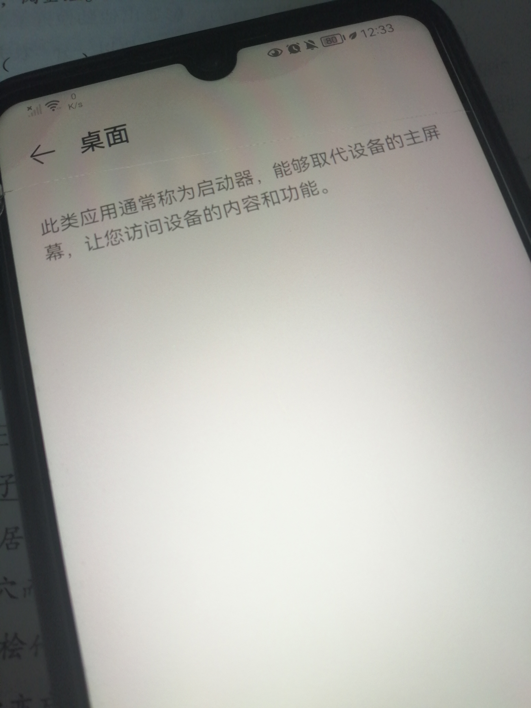

### 2023.6.7 第二台华为机桌面去世记

今日下午，我看着另一台手机里的鸿蒙3.0更新提示，又看了看我的软件。我考虑了很久关于我的软件能否正常运行的问题。可我，忽略了一个重要问题：

**偷渡3.0手机管家后有没有降级(原因下面会讲)**

我有点犹豫地下载并安装了上去，漫长的等待后，终于装好了。

我重新给它激活Shizuku后，发现第三方桌面被禁用了，剩下的只有"为防止桌面被恶意劫持，如果你选择系统桌面，你将无法使用第三方桌面。"这么讽刺的提示。

我慌了，把软件备份好后，拿回去立刻降级了。

可是降级后，事情变得更糟糕了。我配置好所有软件后，想用软件偷渡法重新夺回桌面的主控权。可是依然无效，我不断地更新又降级，设置重新安装，停用华为桌面……

我仿佛在死亡的边缘挣扎着，无力地挣扎。

最后，我实在被折磨得受不了了，去找了解锁BL的教程。

正当我注册Chimera账号之后以为它可以帮助我的时候，我太天真了——需要购买许可证。

我陷入绝望之中。

我白白浪费了两个小时，整整两个小时，可以让我再看一次《铃芽之旅》的时间。

最终，我选择了最笨，最粗暴，最难受的方法——禁用华为桌面。

……

我对华为的看法，彻底变了。

也许有人会问，不就是一个第三方桌面嘛，至于吗？

可是，手机是你的，你应该享有全部的权利。

别以为自己有这么领先的科技就很厉害了，你不考虑用户的感受？一刀切？

解锁码2018年停止提供，现在第三方桌面全面禁用。这是你的手机？对不起，你只有使用权。

如果是我的家人们看到，请以后买手机的时候考虑一下好不好用，有没有限制，而不是多么nb的功能，花里胡哨的东西。

谢谢各位能看到这里，我将忘不了这段经历。

6.8日补充：

> 个人认为，华为除了封闭，没有什么可以吐槽的地方了。手机质量还是很好的，不过可惜的是没办法玩出花样来了。
